# Project 11: ANSIBLE CONFIGURATION MANAGEMENT AUTOMATE PROJECT 7 TO 10.

## Table of Contents
- [Introduction](#introduction)
- [Prerequisites](#prerequisites)
- [Install and configure Ansible on an EC2 instance](#install-and-configure-ansible-on-an-ec2-instance)
- [Prepare your development environment using Visual Studio Code](#prepare-your-development-environment-using-visual-studio-code)
- [Begin Ansible Development](#begin-ansible-development)
- [Set up an Ansible inventory](#set-up-an-ansible-inventory)
- [Create a Common Ansible Playbook](#create-a-common-ansible-playbook)


## Introduction
In this project, we would be configuring Ansible Client as a Bastion Host also known as Jump Server. A Jump server is an intermediary server through which access to the internal network can be provided. If we should consider the current architecture being worked on, the web servers are always inside a secure network that cannot be reached directly from the internet. This means that even a DevOps engineer cannot ssh into the web servers directly except through a Jump server, this provides better security and reduces attack surface.

In the diagram shown below the Virtual Private Network is divided into two subnets:
- Public subnet: This has public IP addresses and is accessible from the internet.
- Private subnet: This is only reachable by private IP addresses and is not accessible from the internet.


In this project, we would develop Ansible scripts to simulate the use of a Jump Box to access our Web Servers.


## Prerequisites
- Infrastructure: AWS.
- Web Servers: Linux Red Hat.
- Database Server: Ubuntu 20.04 + MySQL.
- Storage Server: Red Hat 8 + NFS.
- Load Balancer: Ubuntu 20.04 (Nginx).
- Jenkins Server.
- Configure Ansible.

## Install and configure Ansible on an EC2 instance.
For this tutorial, we would be making use of our Jenkins server to configure Ansible.

- Update the Name tag on the Jenkins server to `Jenkins-Ansible`. We would be using this server to run playbooks.

Results:


- In your GitHub account create a new repository and name it ansible-config-mgt

Results:


- Install Ansible
```
sudo apt update
sudo apt install ansible
```

Results:
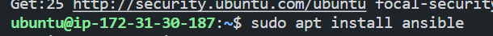

- Check your Ansible version
```
ansible --version
```

Results:
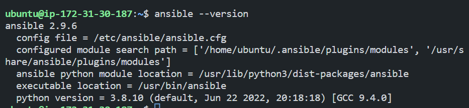

- configure Jenkins build job to save your repository content every time you change it

Results:
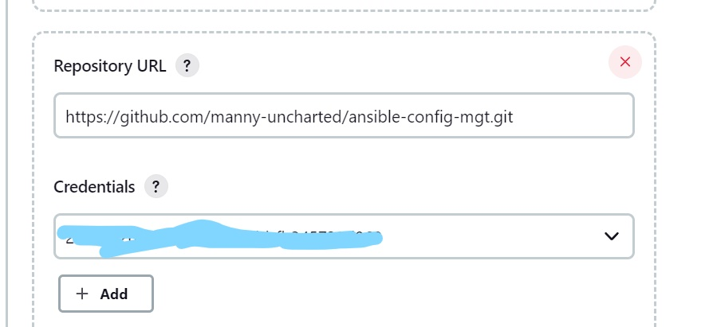

- Test your setup by making some changes to the readme file in <i>main<i> branch and make sure that builds start automatically and jenkins saves the files (build artifacts)

Results:
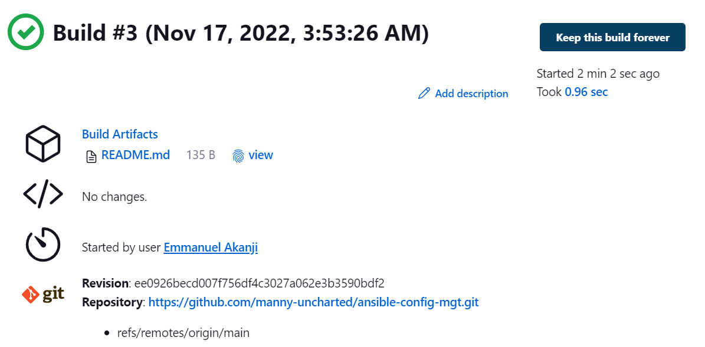

Note: Every time you stop/start your Jenkins-Ansible server – you have to reconfigure the GitHub webhook to a new IP address, to avoid it, it makes sense to allocate an Elastic IP to your Jenkins-Ansible server. Note that Elastic IP is free only when it is being allocated to an EC2 Instance, so do not forget to release Elastic IP once you terminate your EC2.


## Prepare your development environment using Visual Studio Code
- Install Visual Studio Code on your local machine. You can download it from <a href="https://code.visualstudio.com/download">here</a>. As a DevOps engineer the first part is Dev which means you have to be a developer, so you have to be comfortable with your development environment. I would recommend Visual Studio Code as it is free and open source. It is also cross-platform and supports multiple languages.

- After installing Visual Studio Code, configure it to connect to your newly created GitHub repository.

- Then you clone down your ansible-config-mgt repo to your Jenkins-Ansible instance.
```
git clone <ansible-config-mgt repo link>
```

Results:
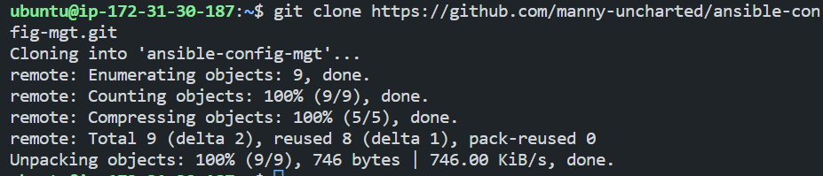


## Begin Ansible Development
- In your ansible-config-mgt repo, create a new branch called `ansible-dev` and switch to it. This would be used for the development of a new feature.

```
git checkout -b ansible-dev
```

Results:
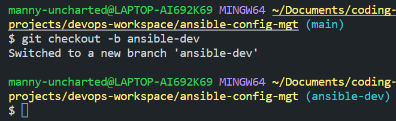

Note: You should give your branches descriptive and comprehensive names. For example, if you use Jira or Trello as a project management tool – include the ticket number (e.g. PRJ-145) in the name of your branch and add a topic and a brief description of what this branch is about – a bugfix, hotfix, feature, release (e.g. feature/prj-145-lvm)

- Create a directory and name it playbooks. This would be used to store all your playbook files.

Results:

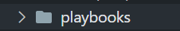

- Create a directory and name it inventory. This would be used to keep your host organized.

Results:


- Within the playbooks folder, create your first playbook and name it <i>common.yml</i>.

Results:

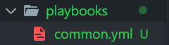

- Within the inventory folder, create an inventory file for each environment (Development, Staging, Testing and Production) dev, staging, uat and prod respectively.

Results:

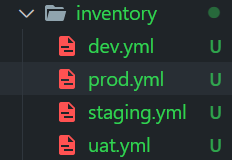


## Set up an Ansible inventory
An Ansible inventory file defines the hosts and groups of hosts upon which commands, modules, and tasks in a playbook operate. Since our intention is to execute Linux commands on remote hosts and ensure that it is the intended configuration on a particular server that occurs. It is important to have a way to organize our hosts in such an Inventory.

To learn how to setup SSH agent and connect VS Code to your Jenkins-Ansible instance, see the video below:

- For Windows users - <a href="https://youtu.be/OplGrY74qog">Set up SSH agent on Windows</a>
- For Linux users - <a href="https://youtu.be/OplGrY74qog">Set up SSH agent on Linux</a>

- Add your private key to the SSH agent
```
ssh-add <path-to-private-key>
```

- Now you confirm that your key has been added to the SSH agent
```
ssh-add -l
```

Results:
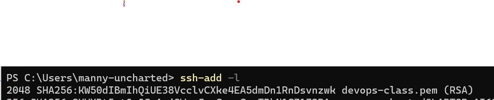

- Now you can connect to your Jenkins-Ansible instance from VS Code using SSH agent. To do this, click on the green icon on the bottom left corner of VS Code and select `Remote-SSH: Connect to Host...` and select your Jenkins-Ansible instance. Before this in the video on setting up SSH-agent, we've set up our ssh config host file to contain the URL to the Jenkins-ansible instance.

Note: For ubuntu instances, the username is ubuntu and for RHEL-based instances, the username is ec2-user.


- Update the inventory/dev.yml file with a snippet of code
```
[nfs]
<NFS-Server-Private-IP-Address> ansible_ssh_user='ec2-user'

[webservers]
<Web-Server1-Private-IP-Address> ansible_ssh_user='ec2-user'
<Web-Server2-Private-IP-Address> ansible_ssh_user='ec2-user'

[db]
<Database-Private-IP-Address> ansible_ssh_user='ec2-user' 

[lb]
<Load-Balancer-Private-IP-Address> ansible_ssh_user='ubuntu'
```

Results:

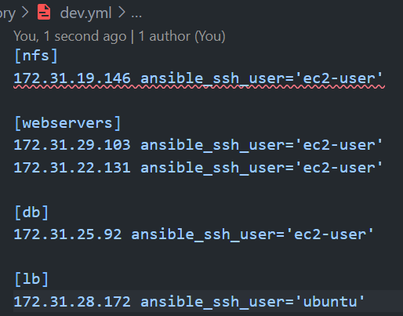


## Create a Common Ansible Playbook

At this stage of the project, it is time to start giving Ansible the instructions on what we need to be performed on all servers listed in inventory/dev.

In the common.yml playbook, we would write configuration for repeatable, reusable, and multi-machine tasks that is common to systems within the infrastructure.

- Update your playbooks/common.yml file with a snippet of code
```
- name: update web, nfs and db servers
  hosts: webservers, nfs, db
  remote_user: ec2-user
  become: yes
  become_user: root
  tasks:
    - name: ensure wireshark is at the latest version
      yum:
        name: wireshark
        state: latest

- name: update LB server
  hosts: lb
  remote_user: ubuntu
  become: yes
  become_user: root
  tasks:
    - name: Update apt repo
      apt: 
        update_cache: yes

    - name: ensure wireshark is at the latest version
      apt:
        name: wireshark
        state: latest
```

Results:

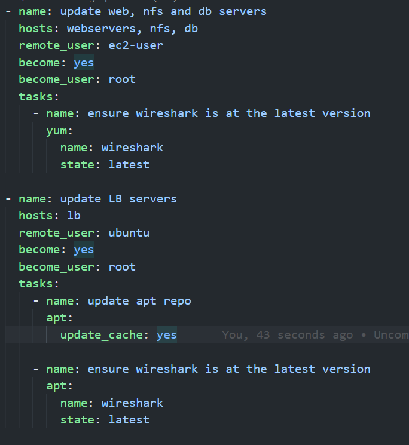

Note: The code above is divided into two parts, each of which is intended to perform the same task: which is installing the Wireshark utility on RHEL 8 and Ubuntu servers. It uses root user to perform this task and the respective package manager: yum for RHEL 8 and apt for Ubuntu.